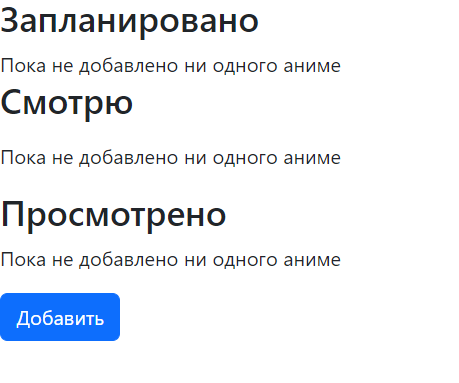
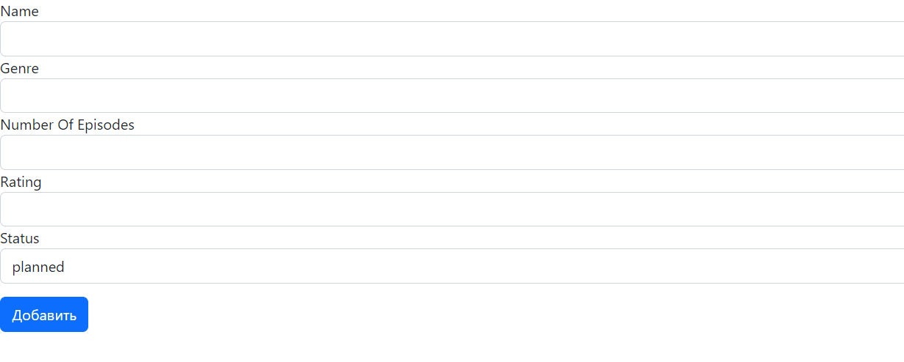
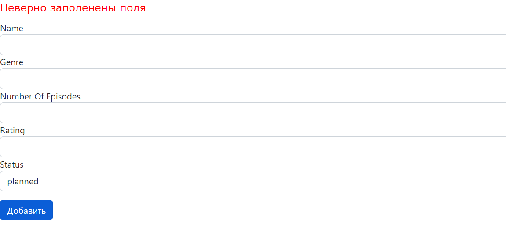
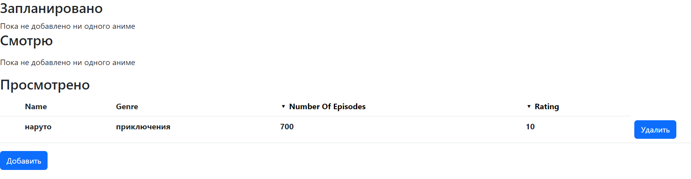
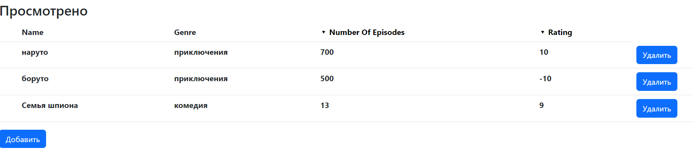
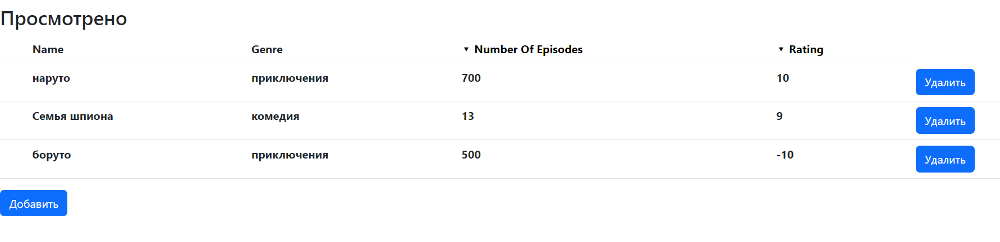

The anime list makes it possible to keep a record of anime. All anime can be marked in your sheet.

The start page displays an empty list, which makes it possible to fill it in.

To add anime, you need to fill out the form.

If one of the fields is empty, the anime will not be added.

If necessary, the anime can be deleted.

There is filtering by the number of episodes

and rating

Stack:

java 17,
Spring data,
Spring web,
Postgres,
Thymeleaf

